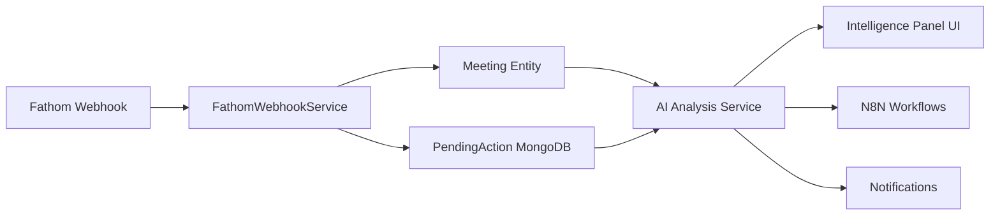

# AI/Intelligence Framework Design for Meeting Manager
## Leveraging Fathom Data for Smart Insights

### Executive Summary

This document outlines the design and implementation strategy for incorporating AI-powered intelligence into Meeting Manager, with particular focus on leveraging rich Fathom meeting data (transcripts, summaries, action items, speaker analytics) to provide automated insights, predictive analytics, and workflow automation.

---

## 1. Data Sources for AI/Intelligence

### 1.1 Existing Data Sources
- **Meetings**: Title, description, participants, duration, type, status
- **Action Items**: Tasks, assignments, due dates, priorities, completion rates
- **Participants**: Attendance patterns, roles, engagement metrics
- **Notes**: Meeting notes, decisions, discussion topics

### 1.2 New Fathom Data Sources ✨
- **Transcripts**: Full conversation with speaker attribution and timestamps
- **AI Summary**: Fathom-generated meeting summaries
- **Action Items**: Extracted action items with context and timestamps
- **Recording Links**: Timestamped video playback for context
- **Speaker Analytics**: Who spoke, when, and for how long
- **Topic Detection**: Key topics discussed during meeting
- **Sentiment Analysis**: Tone and sentiment of discussions

---

## 2. AI/Intelligence Capabilities

### 2.1 Meeting Effectiveness Analysis ✅ **Already Implemented**

**Current Implementation:**
- Attendance rate tracking
- Missing stakeholders detection
- Basic effectiveness scoring

**Fathom Enhancements:**
```typescript
interface MeetingEffectiveness {
  score: number;  // 1-10
  strengths: string[];
  improvements: string[];

  // NEW: Fathom-powered metrics
  talkTimeDistribution: {
    participant: string;
    percentage: number;
    balanced: boolean;  // True if within 20-30% range
  }[];
  decisionCount: number;  // Extracted from Fathom summary
  actionableItemsRatio: number;  // Action items / meeting duration
  topicCoverage: number;  // % of agenda topics discussed
  sentimentScore: number;  // Overall meeting sentiment (-1 to 1)
}
```

**Implementation Approach:**
```typescript
// Service method to analyze Fathom transcript
async analyzeFathomMeeting(meeting: Meeting): Promise<MeetingEffectiveness> {
  const transcript = meeting.transcriptEntries || [];

  // 1. Calculate talk time distribution
  const talkTime = this.calculateTalkTimeDistribution(transcript);

  // 2. Extract decisions from Fathom summary using keywords
  const decisions = this.extractDecisions(meeting.fathomSummary);

  // 3. Calculate actionable items ratio
  const ratio = meeting.actionItems.length / (meeting.durationInMinutes / 30);

  // 4. Analyze topic coverage
  const coverage = this.analyzeTopicCoverage(meeting.agenda, transcript);

  // 5. Calculate sentiment (optional: integrate with sentiment API)
  const sentiment = this.analyzeSentiment(transcript);

  return {
    score: this.calculateEffectivenessScore({talkTime, decisions, ratio, coverage}),
    strengths: this.identifyStrengths(talkTime, decisions, ratio),
    improvements: this.identifyImprovements(talkTime, decisions, coverage),
    talkTimeDistribution: talkTime,
    decisionCount: decisions.length,
    actionableItemsRatio: ratio,
    topicCoverage: coverage,
    sentimentScore: sentiment
  };
}
```

---

### 2.2 Smart Action Item Suggestions ✅ **Already Implemented**

**Current Implementation:**
- Basic action item suggestions
- Priority detection
- Assignment recommendations

**Fathom Enhancements:**
```typescript
interface ActionItemSuggestion {
  title: string;
  description: string;
  priority: 'LOW' | 'MEDIUM' | 'HIGH' | 'URGENT';
  suggestedAssignee: string;
  estimatedHours: number;
  reasoning: string;

  // NEW: Fathom-powered context
  recordingTimestamp: number;  // When this was discussed
  recordingUrl: string;  // Link to exact moment in Fathom
  contextQuote: string;  // Actual quote from transcript
  relatedParticipants: string[];  // Who was involved in discussion
  confidence: number;  // AI confidence score (0-1)
  source: 'fathom_ai' | 'transcript_analysis' | 'manual';
}
```

**Implementation Approach:**
```typescript
async generateSmartSuggestions(meeting: Meeting): Promise<ActionItemSuggestion[]> {
  const suggestions: ActionItemSuggestion[] = [];

  // 1. Parse Fathom action items (already extracted by Fathom)
  const fathomActions = meeting.actionItems.filter(ai =>
    ai.n8nExecutionId?.startsWith('fathom_')
  );

  // 2. Analyze transcript for additional implicit action items
  const transcriptSuggestions = await this.analyzeTranscriptForActions(
    meeting.transcriptEntries
  );

  // 3. Detect follow-up items from decisions
  const followUpSuggestions = this.extractFollowUpsFromDecisions(
    meeting.fathomSummary,
    meeting.keyDecisions
  );

  // 4. Combine and rank by confidence
  return [...fathomActions, ...transcriptSuggestions, ...followUpSuggestions]
    .sort((a, b) => b.confidence - a.confidence);
}

// Example: Analyze transcript for implicit action items
private analyzeTranscriptForActions(transcript: TranscriptEntry[]): ActionItemSuggestion[] {
  const actionKeywords = ['need to', 'should', 'must', 'will', 'going to', 'action item', 'TODO', 'follow up'];
  const suggestions = [];

  for (const entry of transcript) {
    const lowerText = entry.text.toLowerCase();

    // Check if entry contains action keywords
    const hasActionKeyword = actionKeywords.some(keyword => lowerText.includes(keyword));

    if (hasActionKeyword) {
      suggestions.push({
        title: this.extractTitle(entry.text),
        description: entry.text,
        priority: this.inferPriority(entry.text),
        suggestedAssignee: entry.speaker,
        recordingTimestamp: entry.timestamp,
        contextQuote: entry.text,
        relatedParticipants: [entry.speaker],
        confidence: 0.7,
        source: 'transcript_analysis'
      });
    }
  }

  return suggestions;
}
```

---

### 2.3 Participant Engagement Analytics 🆕

**New Capability Leveraging Fathom Data:**

```typescript
interface ParticipantEngagement {
  participant: string;
  speakingTime: number;  // seconds
  speakingPercentage: number;  // % of total meeting time
  contributionCount: number;  // Number of times they spoke
  averageContributionLength: number;  // seconds
  keyTopics: string[];  // Topics they contributed to
  questionCount: number;  // Questions asked
  decisionMaking: 'high' | 'medium' | 'low';  // Involvement in decisions
  engagementScore: number;  // 1-10
}

interface EngagementAnalysis {
  participants: ParticipantEngagement[];
  overallEngagement: number;
  silentParticipants: string[];  // Didn't speak
  dominantSpeakers: string[];  // Spoke >40% of time
  recommendations: string[];
}
```

**Implementation:**
```typescript
async analyzeParticipantEngagement(meeting: Meeting): Promise<EngagementAnalysis> {
  const transcript = meeting.transcriptEntries || [];
  const participantStats = new Map<string, ParticipantEngagement>();

  // Calculate speaking time per participant
  for (const entry of transcript) {
    if (!participantStats.has(entry.speaker)) {
      participantStats.set(entry.speaker, {
        participant: entry.speaker,
        speakingTime: 0,
        contributionCount: 0,
        keyTopics: [],
        questionCount: 0,
        // ...defaults
      });
    }

    const stats = participantStats.get(entry.speaker)!;
    stats.contributionCount++;
    stats.speakingTime += this.estimateSpeakingTime(entry.text);

    // Detect questions
    if (entry.text.includes('?')) {
      stats.questionCount++;
    }
  }

  // Calculate percentages and scores
  const totalSpeakingTime = Array.from(participantStats.values())
    .reduce((sum, p) => sum + p.speakingTime, 0);

  for (const stats of participantStats.values()) {
    stats.speakingPercentage = (stats.speakingTime / totalSpeakingTime) * 100;
    stats.averageContributionLength = stats.speakingTime / stats.contributionCount;
    stats.engagementScore = this.calculateEngagementScore(stats);
  }

  return {
    participants: Array.from(participantStats.values()),
    overallEngagement: this.calculateOverallEngagement(participantStats),
    silentParticipants: this.identifySilentParticipants(meeting.participants, participantStats),
    dominantSpeakers: this.identifyDominantSpeakers(participantStats),
    recommendations: this.generateEngagementRecommendations(participantStats)
  };
}
```

---

### 2.4 Predictive Analytics 🆕

**Capabilities:**

```typescript
interface PredictiveInsights {
  followUpMeetingProbability: number;  // 0-100%
  followUpMeetingReason: string;

  actionItemCompletionRate: number;  // Predicted % completion
  completionRateReasoning: string;

  overdueRisk: 'low' | 'medium' | 'high';
  riskyActionItems: ActionItem[];

  participantBurnoutRisk: {
    participant: string;
    risk: 'low' | 'medium' | 'high';
    workload: number;  // Active action items
    completionRate: number;  // Historical %
  }[];

  meetingPatterns: {
    recurringTopics: string[];
    frequentAttendees: string[];
    averageDuration: number;
    suggestedMeetingType: string;
  };
}
```

**Implementation Using Historical Data + Fathom:**
```typescript
async generatePredictiveInsights(meeting: Meeting): Promise<PredictiveInsights> {
  // 1. Analyze historical meeting data
  const historicalMeetings = await this.getHistoricalMeetings(
    meeting.organization.id,
    meeting.participants.map(p => p.email)
  );

  // 2. Predict follow-up probability
  const followUpProb = this.predictFollowUpProbability(meeting, historicalMeetings);

  // 3. Predict completion rate based on past performance
  const completionRate = await this.predictCompletionRate(meeting);

  // 4. Assess burnout risk
  const burnoutRisk = await this.assessBurnoutRisk(meeting.participants);

  // 5. Identify patterns
  const patterns = this.identifyMeetingPatterns(historicalMeetings);

  return {
    followUpMeetingProbability: followUpProb.probability,
    followUpMeetingReason: followUpProb.reason,
    actionItemCompletionRate: completionRate.rate,
    completionRateReasoning: completionRate.reasoning,
    overdueRisk: this.calculateOverdueRisk(meeting),
    riskyActionItems: this.identifyRiskyItems(meeting.actionItems),
    participantBurnoutRisk: burnoutRisk,
    meetingPatterns: patterns
  };
}
```

---

### 2.5 Intelligent Workflow Automation 🆕

**Auto-Triggered Workflows Based on AI Analysis:**

```typescript
interface WorkflowRecommendation {
  type: 'approval' | 'notification' | 'escalation' | 'follow-up' | 'reminder';
  trigger: string;  // What triggered this recommendation
  priority: 'low' | 'medium' | 'high' | 'urgent';
  description: string;
  automatable: boolean;
  estimatedTimeSaved: number;  // minutes
  n8nWorkflowTemplate?: string;
}
```

**Smart Workflow Triggers:**
1. **High-Priority Action Detected** → Auto-create approval workflow
2. **Missing Stakeholder** → Auto-send meeting summary + recording link
3. **Decision Made** → Auto-notify affected teams
4. **Deadline Approaching** → Auto-send reminders to assignees
5. **Overdue Item** → Auto-escalate to manager
6. **Recurring Topic** → Suggest standing meeting
7. **Silent Participant** → Send engagement prompt

**Implementation:**
```typescript
async analyzeAndRecommendWorkflows(meeting: Meeting): Promise<WorkflowRecommendation[]> {
  const recommendations: WorkflowRecommendation[] = [];

  // 1. Check for high-priority items
  const urgentItems = meeting.actionItems.filter(ai => ai.priority === 'URGENT');
  if (urgentItems.length > 0) {
    recommendations.push({
      type: 'approval',
      trigger: `${urgentItems.length} urgent action items detected`,
      priority: 'high',
      description: 'Create approval workflow for urgent items requiring executive sign-off',
      automatable: true,
      estimatedTimeSaved: 30,
      n8nWorkflowTemplate: 'approval-workflow-urgent-actions'
    });
  }

  // 2. Check for missing stakeholders (from Fathom external contacts)
  const externalContacts = meeting.participants.filter(p => p.isExternal);
  const absentStakeholders = externalContacts.filter(p => !p.attended);

  if (absentStakeholders.length > 0) {
    recommendations.push({
      type: 'notification',
      trigger: `${absentStakeholders.length} key stakeholders absent`,
      priority: 'medium',
      description: 'Auto-send meeting summary and Fathom recording to absent stakeholders',
      automatable: true,
      estimatedTimeSaved: 15,
      n8nWorkflowTemplate: 'notify-absent-stakeholders'
    });
  }

  // 3. Detect decisions from Fathom summary
  const decisions = this.extractDecisions(meeting.fathomSummary);
  if (decisions.length > 0) {
    recommendations.push({
      type: 'notification',
      trigger: `${decisions.length} key decisions made`,
      priority: 'high',
      description: 'Broadcast decisions to affected teams via Slack/Email',
      automatable: true,
      estimatedTimeSaved: 20,
      n8nWorkflowTemplate: 'broadcast-decisions'
    });
  }

  return recommendations.sort((a, b) =>
    (b.priority === 'urgent' ? 3 : b.priority === 'high' ? 2 : b.priority === 'medium' ? 1 : 0) -
    (a.priority === 'urgent' ? 3 : a.priority === 'high' ? 2 : a.priority === 'medium' ? 1 : 0)
  );
}
```

---

### 2.6 Topic & Keyword Extraction 🆕

**Extract key topics from Fathom transcripts:**

```typescript
interface TopicAnalysis {
  mainTopics: {
    topic: string;
    frequency: number;
    firstMentioned: number;  // timestamp
    lastMentioned: number;
    participants: string[];
  }[];
  keywords: {
    word: string;
    count: number;
    relevance: number;
  }[];
  relatedMeetings: Meeting[];  // Meetings with similar topics
}
```

**Implementation:**
```typescript
async analyzeTopics(meeting: Meeting): Promise<TopicAnalysis> {
  const transcript = meeting.transcriptEntries || [];
  const text = transcript.map(e => e.text).join(' ');

  // 1. Extract keywords using TF-IDF or simple frequency
  const keywords = this.extractKeywords(text);

  // 2. Group keywords into topics
  const topics = this.clusterKeywordsIntoTopics(keywords, transcript);

  // 3. Find related meetings
  const relatedMeetings = await this.findRelatedMeetings(topics, meeting);

  return {
    mainTopics: topics,
    keywords: keywords,
    relatedMeetings: relatedMeetings
  };
}

private extractKeywords(text: string): {word: string, count: number, relevance: number}[] {
  // Remove stop words
  const stopWords = ['the', 'is', 'at', 'which', 'on', 'a', 'an', 'and', 'or', 'but', 'in', 'with'];
  const words = text.toLowerCase()
    .split(/\W+/)
    .filter(word => word.length > 3 && !stopWords.includes(word));

  // Count frequency
  const frequency = new Map<string, number>();
  words.forEach(word => {
    frequency.set(word, (frequency.get(word) || 0) + 1);
  });

  // Calculate relevance (simplified TF-IDF)
  return Array.from(frequency.entries())
    .map(([word, count]) => ({
      word,
      count,
      relevance: count / words.length
    }))
    .sort((a, b) => b.relevance - a.relevance)
    .slice(0, 20);
}
```

---

## 3. Implementation Architecture

### 3.1 Service Layer Structure

```
frontend/src/app/services/
├── meeting-ai-assistant.service.ts      (existing)
├── fathom-intelligence.service.ts       (new)
├── predictive-analytics.service.ts      (new)
├── workflow-automation.service.ts       (new)
└── engagement-analytics.service.ts      (new)
```

### 3.2 Backend API Endpoints

```
POST /api/ai/analyze-meeting/{meetingId}
  → Returns MeetingAnalysis with Fathom-enhanced data

GET /api/ai/suggestions/{meetingId}
  → Returns ActionItemSuggestion[] with transcript context

POST /api/ai/engagement/{meetingId}
  → Returns EngagementAnalysis from Fathom transcript

GET /api/ai/predictive-insights/{meetingId}
  → Returns PredictiveInsights

POST /api/ai/workflow-recommendations/{meetingId}
  → Returns WorkflowRecommendation[]

GET /api/ai/topics/{meetingId}
  → Returns TopicAnalysis
```

### 3.3 Integration Points



---

## 4. Implementation Phases

### Phase 1: Fathom Data Enhancement ✅ COMPLETE
- [x] Webhook integration
- [x] Pending actions with timestamps
- [x] Frontend UI enhancements
- [x] Recording playback links

### Phase 2: Basic AI Features (Week 1-2)
- [ ] Enhanced meeting effectiveness scoring using talk time
- [ ] Transcript-based action item extraction
- [ ] Topic and keyword extraction
- [ ] Participant engagement analytics

### Phase 3: Predictive Analytics (Week 3-4)
- [ ] Follow-up meeting prediction
- [ ] Action item completion rate prediction
- [ ] Burnout risk assessment
- [ ] Pattern recognition

### Phase 4: Workflow Automation (Week 5-6)
- [ ] Auto-trigger workflows based on AI insights
- [ ] N8N workflow templates
- [ ] Smart notification system
- [ ] Decision broadcasting

### Phase 5: Advanced Features (Future)
- [ ] Sentiment analysis integration
- [ ] Multi-meeting pattern analysis
- [ ] Team collaboration insights
- [ ] Meeting ROI calculation

---

## 5. Technology Stack

### AI/ML Libraries
- **Natural Language Processing**: Compromise.js (client-side NLP)
- **Keyword Extraction**: TF-IDF implementation
- **Sentiment Analysis**: (Optional) Sentiment.js or external API
- **Pattern Recognition**: Custom algorithms based on historical data

### Backend
- **Spring Boot**: Java services for AI processing
- **MongoDB**: Pending actions and analytics storage
- **PostgreSQL**: Historical meeting data
- **N8N**: Workflow automation engine

### Frontend
- **Angular**: UI components
- **RxJS**: Reactive data streams
- **Chart.js**: Visualizations for insights

---

## 6. Privacy & Security Considerations

1. **Transcript Privacy**: Fathom transcripts contain sensitive information
   - Store with encryption at rest
   - Limit access based on meeting visibility
   - Auto-delete transcripts after 90 days (configurable)

2. **AI Processing**:
   - Process on-premises (no external AI APIs for transcripts)
   - Use client-side NLP where possible
   - Optional: Integrate with private LLM deployment

3. **Data Retention**:
   - Meeting metadata: Indefinite
   - Transcripts: 90 days default
   - AI insights: 1 year
   - Action items: Until completed + 30 days

---

## 7. Success Metrics

### Quantitative
- **Action Item Accuracy**: >85% of AI-suggested items accepted
- **Prediction Accuracy**: Follow-up meetings predicted within 10%
- **Time Saved**: Average 30 min/meeting on post-meeting tasks
- **Workflow Automation**: 60% of workflows auto-triggered

### Qualitative
- User satisfaction with AI suggestions
- Reduction in missed action items
- Improved meeting effectiveness scores
- Better participant engagement

---

## 8. Next Steps

1. ✅ Complete Fathom integration (DONE)
2. **Create FathomIntelligenceService** for transcript analysis
3. **Enhance MeetingIntelligencePanel** component with Fathom features
4. **Implement backend AI analysis endpoints**
5. **Add engagement analytics visualization**
6. **Create workflow automation rules engine**
7. **Test with real Fathom meeting data**
8. **Iterate based on user feedback**

---

**Document Version**: 1.0
**Last Updated**: 2025-10-14
**Author**: Meeting Manager AI Team (Claude)
**Status**: Design Complete, Ready for Implementation
